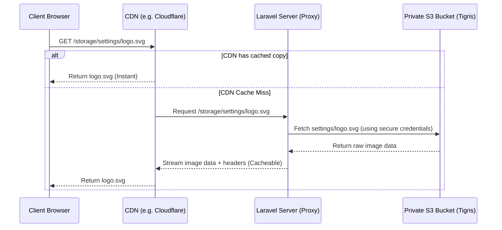

# Image Handling & Private S3 Storage Architecture 🖼️☁️

This document explains the modern unified image storage, uploading, and serving model used in **MyYanga**, specifically designed to handle **private cloud storage buckets** (like Railway Storage/Tigris) without exposing direct S3 credentials or running into expiring links.

---

## 1. The Core Architecture

In modern production environments (such as Railway or AWS), S3 storage buckets are kept **strictly private** for security. This means anonymous internet users cannot download or view files (like Logos, Avatars, or Product images) using S3 URLs directly (e.g. `https://bucket.t3.storageapi.dev/settings/file.png` will return `AccessDenied`).

To solve this, MyYanga uses a **Unified Backend Proxy** combined with **Edge Caching**.



---

## 2. Image Serving & The Proxy Route

Instead of generating expiring temporary links (which break layout assets after 24 hours), the application routes image requests through its own domain using the local `/storage/{path}` endpoint.

### The Streaming Route (`routes/web.php` & `HomeController@serve_file`)
When the browser requests `https://myyanga.com/storage/settings/logo.svg`:
1.  **Nginx/Apache First Look:** The web server checks the local directory `public/storage/settings/logo.svg`.
    *   *Local Dev:* The file exists locally; Nginx/Apache serves it instantly (bypassing PHP completely).
    *   *Production (S3):* The file does not exist locally. Nginx passes the request to Laravel.
2.  **Laravel Proxy Route:** Laravel catches it in a cache-friendly controller route:
    ```php
    Route::get('/storage/{path}', 'HomeController@serve_file')->where('path', '.*')->name('cdn.serve');
    ```
3.  **Secure Private Fetch:** Inside `HomeController@serve_file`, Laravel uses S3 credentials behind the scenes to fetch the raw bytes from your private bucket and stream them directly to the browser with standard headers:
    ```php
    public function serve_file($path)
    {
        /** @var \Illuminate\Filesystem\FilesystemAdapter $disk */
        $disk = Storage::disk('public');

        if (!$disk->exists($path)) {
            abort(404);
        }
        return $disk->response($path);
    }
    ```

---

## 3. Uploading & DB Structure (Settings & Models)

We store **only relative paths** in the database rather than storing absolute S3 URLs, ensuring database portability.

### A. Admin Settings (Logo, Backgrounds)
When you upload a logo or background in `SettingsController@update_image`:
1.  **Store:** It is saved on the dynamic `public` S3/Local disk: `$request->pictures[0]->store('settings', 'public')`.
2.  **Value:** We store only the relative path (e.g. `settings/xxxxx.svg`) in the `settings` database table.
3.  **Eloquent Accessor (`app/Settings.php`):** To avoid editing dozens of Blade views, we added an Eloquent Accessor. When Laravel loads settings, this accessor dynamically converts relative paths to the proxy URL on-the-fly, while remaining backward compatible with old absolute links:
    ```php
    public function getValueAttribute($value)
    {
        if (in_array($this->name, ['logo', 'background_1']) && $value && !\Illuminate\Support\Str::startsWith($value, ['http://', 'https://'])) {
            /** @var \Illuminate\Filesystem\FilesystemAdapter $disk */
            $disk = \Illuminate\Support\Facades\Storage::disk('public');
            return $disk->url($value);
        }
        return $value;
    }
    ```

### B. Everywhere Else (Products, Avatars, Blog, Ads, PYL)
1.  **Store:** Stored using standard S3 keys: `$file->store('products', 'public')`.
2.  **Helpers:** Blade templates resolve the image URL using the custom helper class `StorageHelper`:
    ```php
    {{ \App\Helpers\StorageHelper::getUrl('public', $product->photo) }}
    ```
    This helper is fully unified to call `$storageDisk->url($path)`, returning the permanent proxy URL (`/storage/...`), completely eliminating cryptographic signature load times on page rendering.

---

## 4. Production Benefits
*   **CDN Caching (Free Bandwidth):** Because proxy URLs are permanent and unchanging, you can cache them at the edge using a CDN (like Cloudflare or Railway CDN). Your server and S3 bucket are only hit once per image, resulting in zero repeating egress bandwidth charges.
*   **No Link Expirations:** All layout assets, logos, and product links are permanent and will never go stale.
*   **Zero CPU Page Loads:** Eliminates costly cryptographic AWS signature checks when generating product catalogs.

---

## 5. ⚠️ Footnote: Railway's `APP_URL` Snafu

When deploying on **Railway**, there is a common pitfall with environment variables:

> [!WARNING]
> If you configure `APP_URL` in your Railway dashboard as `php-web-service-production.up.railway.app` (**without the `https://` prefix**), Laravel will generate base URLs without a protocol.
> 
> The browser will interpret this as a relative path and try to resolve it from the current page origin, resulting in a **double domain URL**:
> `https://your-app.up.railway.app/your-app.up.railway.app/storage/settings/logo.svg`
> 
> **The Fix:**
> In your Railway dashboard -> Variables tab, always make sure to set `APP_URL` with a fully qualified protocol prefix:
> ```env
> APP_URL=https://php-web-service-production.up.railway.app
> ```
